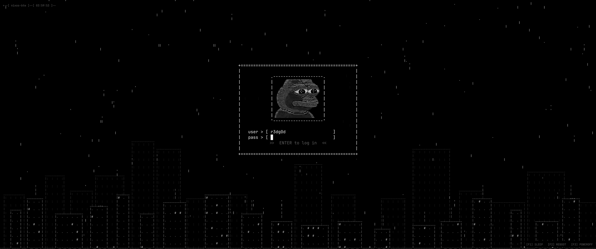
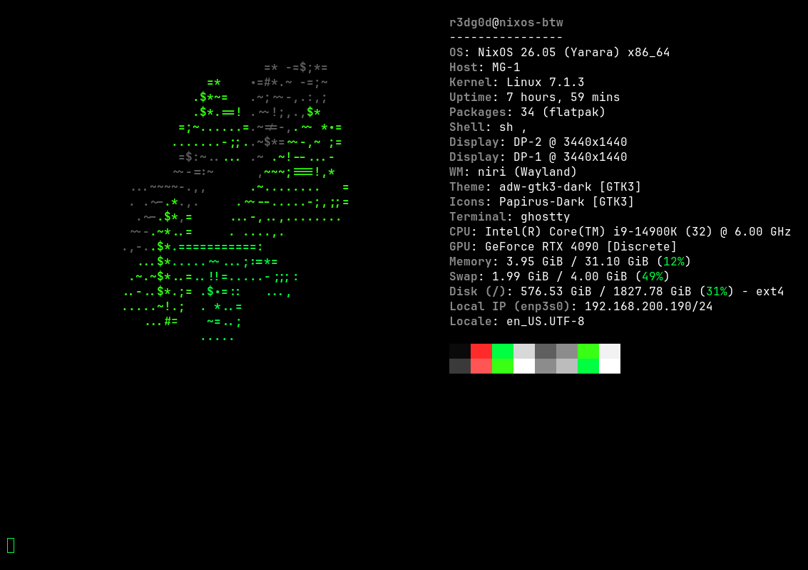
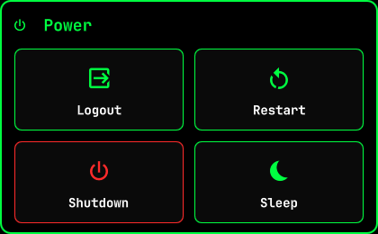
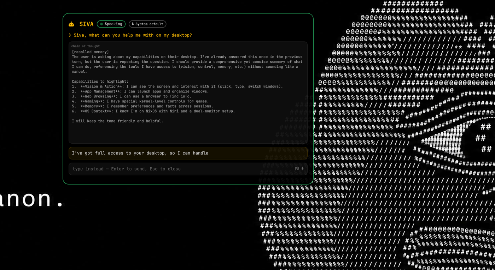

<div align="center">

# ❄️ nixos-dotfiles

**A fully-declarative NixOS flake for `nixos-btw` — a [niri](https://github.com/YaLTeR/niri) + [COSMIC](https://system76.com/cosmic) Wayland rice in OLED black, white, and neon green (`#00ff41`).**

Ricing, a local agentic voice assistant, degoogled daily drivers, gaming, video editing, and privacy tooling — all reproducible from one `./install.sh`.

</div>

---

## 🚀 Install

On a fresh NixOS machine:

```sh
git clone https://github.com/r3dg0d/nixos-dotfiles
cd nixos-dotfiles
./install.sh
```

That is the whole thing. The script does not configure the desktop itself —
everything is declared in the flake — it just does what a declarative
configuration cannot do for itself:

1. checks this really is NixOS, that `nix`/`git` are present, that flakes can be
   used, and that there is enough room on `/nix`
2. picks the flake host (see [Hosts](#-hosts))
3. makes sure `hosts/<host>/hardware-configuration.nix` describes **this**
   machine — generating one if absent, and refusing to silently overwrite one
   that already matches (see [Portability](#-portability))
4. generates `/etc/searxng.env`, the one secret that is deliberately not in git
5. `nixos-rebuild build`, and only if that succeeds, `nixos-rebuild switch`
6. offers to download SIVA's speech models
7. prints a status report of what works and what is waiting on a reboot

```
  NixOS configuration ....... OK
  Flake ..................... OK
  NVIDIA .................... OK (580.95.05)
  PipeWire .................. OK
  Niri ...................... OK (niri.desktop)
  COSMIC .................... OK (cosmic.desktop)
  SDDM ...................... OK (running)
  sddm-ascii-city ........... OK (theme installed + selected)
  Waybar .................... OK
  Ghostty ................... OK
  Wallpaper ................. OK (deployed from the repo)
  llama-server .............. OK (active)
  SIVA ...................... OK (active)
  SIVA wake word ............ OK (active)
  SIVA-Voicefetch ........... OK (active)
  SIVA-Type ................. OK (active)
```

Useful flags:

| Flag | Effect |
| --- | --- |
| `--host NAME` | Install a specific host from the flake |
| `--build-only` | Prove it builds; change nothing |
| `--regenerate-hardware` | Replace `hardware-configuration.nix` (old one is backed up) |
| `--fetch-assets` / `--no-fetch-assets` | Decide the model download up front |
| `-y`, `--yes` | Unattended; take the safe default for every prompt |

### Prerequisites

- NixOS (26.05 or newer). The script refuses to run anywhere else.
- An EFI machine — `hosts/nixos-btw` uses systemd-boot.
- Roughly 40 GiB free in `/nix` for a first build, plus ~18 GiB for SIVA's LLM
  weights if you want the assistant.
- Nothing else. Flakes do not have to be enabled beforehand; the installer
  passes the experimental features per-command until the new configuration
  makes them permanent.

## 🏠 Hosts

```
nixos-btw   i9-14900K · RTX 4090 · Focusrite Scarlett 2i2 · dual 3440×1440
```

`install.sh` picks the host by `--host`, then by matching `$(hostname)`, then —
if only one exists — that one, and otherwise asks. Adding a machine means
adding a directory under `hosts/` and one entry to the `hosts` attrset in
[`flake.nix`](flake.nix); the installer discovers it from there.

---

## 🖥️ The desktop


A tiling niri session on dual 3440×1440 ultrawides: an ASCII-art wallpaper, a
slim [waybar](https://github.com/Alexays/Waybar), and a
[quickshell](https://quickshell.org/) layer for widgets and overlays.
Everything is themed to the same OLED-black / white / neon-green (`#00ff41`)
palette — down to the zsh syntax highlighting, the
[starship](https://starship.rs/) prompt, and the Ghostty colour scheme.

**COSMIC** is installed alongside niri rather than instead of it. Both register
a Wayland session, and you choose between them at the login screen.

GTK apps follow the same dark palette: `adw-gtk3-dark` with `Papirus-Dark`
icons. GTK4/libadwaita apps — Nautilus above all — ignore `gtk.theme` and read
the XDG colour-scheme preference instead, so `color-scheme = prefer-dark` is
set in dconf as well; without it Nautilus stays light. niri has no desktop
environment to answer the Settings portal, so that is routed to the GTK
backend ([`modules/nixos/desktop/portals.nix`](modules/nixos/desktop/portals.nix))
to get the preference out to Flatpaks and portal-aware apps.

Default applications ([`modules/home/desktop.nix`](modules/home/desktop.nix)):
ungoogled-chromium for web, **mpv** for audio and video, **imv** for images,
**COSMIC Edit** for text. Every mime type is enumerated explicitly — declaring
an association in a `.desktop` is not the same as being the default for it.

## 🔐 SDDM login theme — `sddm-ascii-city`



A custom SDDM theme, packaged as a Nix derivation in
[`pkgs/sddm-ascii-city.nix`](pkgs/sddm-ascii-city.nix) from the sources in
[`sddm-ascii-city/`](sddm-ascii-city) (kept byte-identical to the standalone
[r3dg0d/sddm-ascii-city](https://github.com/r3dg0d/sddm-ascii-city) repo):
animated ASCII rain falling over a procedural ASCII city skyline, a grayscaled
avatar, and a minimalist ASCII login box.

A `systemd` service plays login music straight to the Scarlett 2i2 over ALSA
while the greeter is on screen (the QML greeter has no PipeWire to play
through), and stops the instant a session starts.

### Choosing Niri or COSMIC at the greeter

The login box has a third field:

```
|   user > [ r3dg0d                  ]|
|   pass > [ ********                ]|
|   desk > [ < Niri          2/2  > ]|
```

| Input | Effect |
| --- | --- |
| `←` / `→` | Previous / next desktop — from *any* field, so you never leave the password box |
| `Tab` | `user` → `pass` → `desk` → `user` |
| `↑` / `↓` | Previous / next desktop, when `desk` has focus |
| Click `<` / `>` / the name | Step / advance |
| Scroll over the field | Previous / next |
| `Enter` | Log in with the shown desktop |

**Nothing about the list is hardcoded.** It is SDDM's own `sessionModel`, so it
shows exactly the sessions SDDM found — install a third desktop and it appears
by itself. `sddm.login()` gets the model index, so the highlighted session is
the one that actually starts.

Two environment variables in
[`modules/nixos/desktop/sddm.nix`](modules/nixos/desktop/sddm.nix) make this
work reliably on NixOS, and both are commented at length there:

- `QML_XHR_ALLOW_FILE_READ=1` — lets the theme re-resolve the remembered
  session from `/var/lib/sddm/state.conf` by *basename*. SDDM stores an
  absolute store path, which every rebuild invalidates; without this you
  silently get whichever session sorts first (COSMIC) after each rebuild.
- `QML_DISABLE_DISK_CACHE=1` — Qt keys its compiled-QML cache on path + mtime,
  and every store file has `mtime=1`, so the greeter would otherwise keep
  replaying the QML it compiled the first time you installed the theme.

Test theme changes without logging out:

```sh
nix shell nixpkgs#qt6.qtbase nixpkgs#qt6.qtdeclarative \
  -c ./sddm-ascii-city/test/run-harness.sh
```

(`sddm-greeter-qt6 --test-mode` swallows QML errors, so a broken theme looks
identical to a working one. The harness stubs the four context properties SDDM
injects and asserts on what the selector actually resolved to.)

## 🖼️ `fetch` — animated 3D system info



The terminal is [Ghostty](https://ghostty.org/) — GPU-accelerated, with custom
shader support — running [areofyl/fetch](https://github.com/areofyl/fetch), a
neofetch-style tool that spins a **3D ASCII distro logo** next to the system
info. Pulled in as the `areofyl-fetch` flake input. Ghostty is `$TERMINAL` and
`Mod+Return`; alacritty stays on `Mod+Shift+Return` as a fallback.

> The screenshot was taken in ratty, which Ghostty replaced.
> _TODO: retake it._

## 🧰 Waybar


Workspaces and focused-window title on the left, clock in the center, and a
status cluster on the right — weather, temperatures, volume, network, CPU and
memory, an MPD player widget, the Mirror toggle, and a power button that opens
the quickshell power menu.

## 🪟 Quickshell widgets



Hand-written [quickshell](https://quickshell.org/) components in
[`config/quickshell/`](config/quickshell), all in the same neon-green theme and
driven by IPC (`qs ipc call <target> toggle`):

- **Clipboard manager** — `cliphist` history with fuzzy search (`Mod+C`)
- **Wi-Fi picker** — `nmcli` network menu (waybar network click)
- **Power menu** — logout / restart / shutdown / sleep
- **Mirror** — a floating webcam window
- **SIVA overlays** — the voice-assistant status panel, live agentic screen
  stream, dictation overlay, voice-model browser, and enrollment wizard

---

## 🎙️ SIVA — a local agentic voice assistant



[**SIVA**](https://github.com/r3dg0d/siva) (Super Intelligent Voice Assistant)
is a fully-local, agentic desktop assistant. Press **F8**, talk, and it sees the
screen (vision via llama.cpp), reasons out loud in the overlay, drives the
desktop — cursor, clicks, typing, window management — then speaks its answer. It
has **durable cross-session memory** via
[MemPalace](https://github.com/MemPalace/mempalace) (what `programs.nix-ld` is
enabled for) and can search the web through the local SearXNG. No cloud, no API
keys.

| Key | Tool | What it does |
| --- | --- | --- |
| **F7** | [siva-voicefetch](https://github.com/r3dg0d/siva-voicefetch) | Browse/download RVC voice models for TTS |
| **F8** | [siva](https://github.com/r3dg0d/siva) | Push-to-talk agentic voice assistant |
| **F9** | [siva-type](https://github.com/r3dg0d/siva-type) | AI dictation — speak to type anywhere |
| *"Siva"* | siva-wake | Wake word — fires F8 hands-free |

### How it is packaged

The three upstream repos are **vendored** into
[`pkgs/siva/src`](pkgs/siva), [`pkgs/siva-type/src`](pkgs/siva-type) and
[`pkgs/siva-voicefetch/src`](pkgs/siva-voicefetch) and built as real
derivations: interpreters pinned, every runtime tool (`whisper-cli`, `piper`,
`pw-record`, `wpctl`, `wtype`, `ydotool`, `grim`, `tesseract`, `niri`, `socat`,
`sox`, …) wrapped onto `PATH`, and the scripts' old `~/.local/bin` references
rewritten to point inside the derivation. Nothing has to be copied into your
home directory for the stack to work.

They are vendored rather than pulled as flake inputs so the exact code that
runs on this machine is what ships — including work not yet pushed upstream.
Re-sync from a development checkout by copying `bin/` (and `lib/`) over
`pkgs/<name>/src/`.

> **Migrating from a hand-installed copy:** `~/.local/bin` comes first on the
> user's `PATH` (`home.sessionPath`), so old copies of `siva`, `siva-daemon`,
> `siva-type`, … sitting there will *shadow* the packaged ones — and those old
> copies still point back into `~/.local/bin` instead of the store.
> `install.sh` reports this as **"No shadowed SIVA copies"** and prints the
> exact `rm` to run. Deleting them is left to you.

### Services

Everything is a **systemd user service** — nothing runs as root, and nothing
depends on niri's `spawn-at-startup`, so the whole stack comes up under COSMIC
too.

| Unit | Starts at | Restart | Notes |
| --- | --- | --- | --- |
| `siva-llama-server.service` | `default.target` | `on-failure`, no give-up | The LLM backend. No Wayland needed, so it is warm before you finish logging in (the user has `linger`). |
| `siva.service` | `graphical-session.target` | `on-failure`, 5×/5 min | The orchestrator. `Wants=` llama-server. |
| `siva-wake.service` | `graphical-session.target` | `on-failure`, 5×/5 min | `Requires=siva.service` — nothing to toggle without it. |
| `siva-type.service` | `graphical-session.target` | `on-failure`, 5×/5 min | Dictation. |
| `siva-voicefetch.service` | `graphical-session.target` | `on-failure`, 5×/5 min | Voice-model downloader. |

`WAYLAND_DISPLAY`, `XDG_RUNTIME_DIR` and `DBUS_SESSION_BUS_ADDRESS` are **not**
hardcoded anywhere: both `niri --session` and `cosmic-session` import the
session environment into systemd and pull up `graphical-session.target`, and
the units hang off that.

```sh
systemctl --user status siva.service
journalctl --user -u siva-llama-server.service -f
systemctl --user restart siva.service
```

The F7/F8/F9 keys run the *toggle clients*, which send one JSON message to the
daemon's socket and start the daemon themselves if the unit is stopped — so
they are safe to press whatever state things are in.

### llama-server

Configured entirely through Nix options
([`modules/nixos/siva/llama-server.nix`](modules/nixos/siva/llama-server.nix)):

```nix
services.siva.llama = {
  host = "127.0.0.1";        # loopback only — the server is unauthenticated,
  port = 8090;               # and an assertion stops you binding it wider
  modelDir = "…/models/gemma-4-31b";
  model    = "gemma-4-31B-it-qat-UD-Q4_K_XL.gguf";
  mmproj   = "mmproj-F16.gguf";
  contextSize = 4096;        # also exported to the daemons as SIVA_LLAMA_CTX
  gpuLayers = 99;
  cuda = true;               # follows my.nvidia.enable
};
```

An `ExecCondition` checks the weights are readable before starting, so a
machine without them logs one skip instead of a restart loop. Hardening is on
(`ProtectSystem=strict`, `ProtectHome=read-only`, `NoNewPrivileges`,
address-family restrictions, …) but deliberately stops short of
`MemoryDenyWriteExecute` and `PrivateDevices`, which break CUDA.

DaVinci Resolve and the LLM both want the 4090's VRAM, so a small watcher
(`davinci-llm-pause.service`) stops the server while `resolve` is running and
restarts it on quit — but only if *it* stopped it, so a manual stop stays
stopped.

### Models and assets

The weights are **not** in the nix store — ~18 GB of the LLM plus ~250 MB of
speech models, all user data that changes independently of the system.

```sh
siva-fetch-assets      # whisper STT + piper voice + openWakeWord (idempotent)
```

The LLM GGUFs go in `services.siva.llama.modelDir` by hand (the script prints
the exact command). Then:

```sh
systemctl --user restart siva-llama-server
```

The wake word needs a one-time enrollment before `siva-wake` does anything:

```sh
siva-enroll            # say "Siva" a few times
```

### SIVA-Voicefetch

Searches voice-models.com, downloads and unpacks RVC v2 models into
`~/.local/share/siva/voices`, and publishes the chosen one to
`~/.local/share/siva/voice.json` — the single file `siva-daemon` reads to decide
between RVC and plain piper. That file is the entire integration surface
between them, so no extra wiring is needed.

The RVC *inference* stack (torch, transformers, the vendored RVC code) is far
too large and churn-prone to pin here, so it lives in a user-owned virtualenv
built on demand:

```sh
siva-rvc-setup         # ~2.5 GB of torch; idempotent
```

Microphone selection is **not** hardcoded. Both this and `siva-daemon`
enumerate inputs through `wpctl` at runtime and share the choice in
`~/.local/share/siva/mic.json`, so swapping audio interfaces just works.

### SIVA-Type and input permissions

Typing into the focused surface is Wayland-native, not X11 — XWayland is not
required anywhere in the stack:

- **`wtype`** uses the `zwp_virtual_keyboard_v1` protocol, which niri
  implements. This is the normal path and needs **no privileges at all**.
- **`ydotool`** is the uinput fallback for surfaces that refuse virtual-keyboard
  input, and for SIVA's pointer control. It needs `/dev/uinput`, which
  `programs.ydotool` provides through a *system* `ydotoold` socket group-owned
  by `ydotool`.

**The one unavoidable permission:** the user is in the `ydotool` group
(`modules/nixos/core.nix`), which grants access to that socket — and therefore
the ability to synthesise arbitrary input system-wide. That is inherent to
uinput-level control; there is no narrower mechanism. Nothing runs as root, and
no blanket `/dev/uinput` permission is granted to every process. Drop the group
(and `services.siva.enable = false`) if you do not want it.

## 🖼️ Wallpaper

The canonical copy lives in the repository at
[`assets/wallpapers/wallpaper.jpg`](assets/wallpapers). Home Manager
materialises it at `~/Pictures/Wallpaper/wallpaper.jpg`:

```nix
home.file."Pictures/Wallpaper/wallpaper.jpg".source = ../../assets/wallpapers/wallpaper.jpg;
```

Both sessions are pointed at that path:

- **niri** — `swaybg` via `spawn-at-startup` in
  [`config/niri/config.kdl`](config/niri/config.kdl) (through `sh -c` so `$HOME`
  is expanded rather than hardcoded)
- **COSMIC** — `cosmic-bg`'s RON config, written declaratively in
  [`modules/home/desktop.nix`](modules/home/desktop.nix)

To change it, replace the file in `assets/wallpapers/` and rebuild.

> Because the COSMIC background config is a store symlink, COSMIC
> Settings › Wallpaper becomes read-only. Delete that block in
> `modules/home/desktop.nix` if you would rather pick wallpapers from the GUI.

---

## 🛠️ Custom tools

- **[feathershot](https://github.com/r3dg0d/feathershot) MKII** — a native
  Wayland screenshot + annotation tool bound to `PrtSc`. `grim`/`slurp` capture
  → a Quickshell overlay for arrows, boxes, circles, freehand and text →
  composited back onto the original capture with cairo at native resolution.
- **[SIVA](https://github.com/r3dg0d/siva)** +
  [siva-type](https://github.com/r3dg0d/siva-type) +
  [siva-voicefetch](https://github.com/r3dg0d/siva-voicefetch)
- **[sddm-ascii-city](https://github.com/r3dg0d/sddm-ascii-city)** — the login theme

## 📦 Daily-driver software

Installed declaratively — mostly [nixpkgs](https://search.nixos.org/packages),
a few Flatpaks, plus flake inputs and vendored derivations.

### Web & communication
| App | Source | Use |
|-----|--------|-----|
| [ungoogled-chromium](https://github.com/ungoogled-software/ungoogled-chromium) | nixpkg | Primary browser (defaults to local SearXNG via managed policy) |
| Firefox / Tor Browser | nixpkg | Secondary / anonymous browsing |
| FreeTube | nixpkg | Privacy-friendly YouTube client |
| browsh | nixpkg | Text-mode browsing in the terminal (drives a headless Firefox) |
| Thunderbird | nixpkg | Email (Gmail replacement) |
| SimpleX Chat · CoyIM · irssi | nixpkg | Private messaging · XMPP/OTR · IRC |

### Creative & media
| App | Source | Use |
|-----|--------|-----|
| **DaVinci Resolve** 21 | vendored ([`pkgs/davinci-resolve.nix`](pkgs/davinci-resolve.nix)) | Video editing (NVENC on the 4090) |
| OBS Studio (CUDA/NVENC) | nixpkg module | Screen recording (wlrobs on niri, ONNX background removal) |
| Blender | **Flatpak** `org.blender.Blender` | 3D |
| mpv · Jellyfin (server + client) | nixpkg | Playback · home media |
| mpd + rmpc · EasyEffects | nixpkg | Music daemon + TUI · PipeWire effects |

### Gaming
| App | Source | Use |
|-----|--------|-----|
| Steam (Proton, Remote Play) | nixpkg module | Gaming |
| ProtonPlus | **Flatpak** `com.vysp3r.ProtonPlus` | Proton/Wine version manager |
| PCSX2 · PrismLauncher | nixpkg | PS2 emulation · Minecraft |
| Hydra | wrapped | Game launcher |
| WiVRn | nixpkg module | OpenXR streaming to a standalone headset |

### Productivity
Obsidian · etesync-dav (calendar) · LibreTranslate.

### Privacy & security
Mullvad VPN + encrypted Mullvad DNS (ad/tracker blocking) · Lokinet (`.loki`,
custom-fixed build) · KeePassXC · Monero · qBittorrent · self-hosted SearXNG ·
Wireshark · sqlmap · smap · hashcat.

### Dev & local AI
Claude Code · OpenCode · Codex · VSCodium · Neovim · gh · Docker ·
libvirt/QEMU + virt-manager · the Android SDK/NDK · ARM64 and i686-mingw32
cross-compilers — and the local AI stack: `ollama-cuda`, `llama.cpp` (CUDA),
`whisper.cpp`, `piper-tts`, MemPalace.

### Rice runtime
Ghostty · rofi · waybar · quickshell · mako · swaybg · fastfetch · starship ·
cliphist · Bibata cursors · JetBrains Mono Nerd Font · adw-gtk3-dark +
Papirus-Dark for GTK.

---

## 📁 Layout

```
├── flake.nix                    # inputs, overlays, the hosts map
├── install.sh                   # fresh-machine bootstrap + self-check
│
├── hosts/
│   └── nixos-btw/
│       ├── default.nix          # MACHINE-SPECIFIC only: boot, GPU model, the
│       │                        #   Scarlett filter chain, login music, tz
│       └── hardware-configuration.nix   # generated; never copied between machines
│
├── modules/
│   ├── nixos/                   # everything PORTABLE
│   │   ├── options.nix          #   my.username / my.homeDirectory / my.dotfilesDir
│   │   ├── core.nix             #   nix, kernel, the user, shells, fonts, logind,
│   │   │                        #   NTFS support for the external backup SSD
│   │   ├── networking.nix       #   NetworkManager, Mullvad DNS, lokinet
│   │   ├── audio.nix            #   PipeWire + WirePlumber
│   │   ├── hardware/nvidia.nix
│   │   ├── desktop/{sddm,niri,cosmic,portals,apps}.nix
│   │   ├── programs.nix         #   CLI + security tooling
│   │   ├── services.nix         #   Jellyfin, SearXNG, WiVRn
│   │   ├── virtualisation.nix   #   libvirt/QEMU
│   │   ├── development.nix      #   Android SDK, cross-compilers
│   │   └── siva/                #   the voice stack: options + user services
│   │       ├── default.nix · llama-server.nix · voicefetch.nix · type.nix
│   └── home/                    # Home Manager: shell.nix · desktop.nix · services.nix
│
├── pkgs/                        # everything this repo builds itself
│   ├── default.nix              #   the overlay (also the nixpkgs overrides)
│   ├── sddm-ascii-city.nix · siva/ · siva-type/ · siva-voicefetch/
│   ├── siva-fetch-assets.nix · davinci-resolve.nix
│   └── hydralauncher-wayland.nix · quickshell-mirror.nix · mingw32-cc.nix
│
├── sddm-ascii-city/             # the SDDM theme sources (+ test/run-harness.sh)
├── assets/wallpapers/           # the canonical wallpaper
└── config/                      # dotfiles symlinked live into ~/.config
                                 #   (niri, waybar, quickshell, rofi, mako, mpv,
                                 #    rmpc, nvim, fastfetch, scripts)
```

Two deliberate rules shape this:

- **`config/` is symlinked *out of* the store** (`mkOutOfStoreSymlink`), so
  editing `config/niri/config.kdl` takes effect immediately — niri hot-reloads
  it — with no rebuild. Nothing in the *system* closure depends on the checkout
  location, so a machine with the repo somewhere else still boots and logs in.
- **`hosts/` vs `modules/`** is the portable/machine-specific split. If a
  setting names a UUID, a boot device, a specific GPU, a specific audio
  interface, or a path under someone's home, it belongs in `hosts/`.

## 🧩 Flake inputs & overlays

- **[nixpkgs](https://github.com/NixOS/nixpkgs)** `nixos-26.05` +
  **[home-manager](https://github.com/nix-community/home-manager)** `release-26.05`
- **[areofyl/fetch](https://github.com/areofyl/fetch)** — the animated 3D `fetch`
- Overlays: everything in [`pkgs/`](pkgs), plus `lokinet` patched to build from
  source (nixpkgs marks it broken)

Every input is fetchable from the network, so a clone of this repository is all
a fresh machine needs.

## 🧳 Portability

Machine-specific things — filesystems, UUIDs, boot device, GPU model, NIC,
CPU, the audio interface — live only in `hosts/<name>/`. Everything else is
portable, so installing this environment on a second computer is:

```sh
mkdir hosts/newbox
cp hosts/nixos-btw/default.nix hosts/newbox/default.nix   # then trim it
# add `newbox = { system = "x86_64-linux"; user = "…"; };` to flake.nix
./install.sh --host newbox
```

`install.sh` generates that machine's own `hardware-configuration.nix` and will
**not** overwrite one whose UUIDs already resolve locally.

There are no local-path flake inputs, so nothing has to exist outside the
clone. (`install.sh` still checks for `git+file://` inputs and reports a
missing checkout up front, in case one is ever added.)

## 🔑 Secrets

Nothing secret is committed. The configuration references exactly one file
outside the repo — `/etc/searxng.env`, holding the SearXNG instance key —
which `install.sh` generates with `mode 0600` if it is missing.
The VanillaAmerica+ bot reads its token from a `.env` in its own working copy,
which is likewise never in this repository (and its unit has a
`ConditionPathExists` so it stays quiet on machines that lack it).

---

## 🔄 Updating

```sh
cd ~/nixos-dotfiles
nix flake update                          # all inputs
nix flake update nixpkgs                  # just one
sudo nixos-rebuild switch --flake .#nixos-btw
```

## 🩺 Troubleshooting

**Check it builds before you switch.** A failed build changes nothing; a failed
switch does.

```sh
nixos-rebuild build --flake .#nixos-btw   # or: ./install.sh --build-only
nix flake check                           # evaluates AND builds every host
```

| Symptom | Look at |
| --- | --- |
| A SIVA service is dead | `journalctl --user -u siva.service -n 50` |
| SIVA answers nothing | `systemctl --user status siva-llama-server` — usually the model path or VRAM |
| llama-server "skipped" | the weights are missing; `ls "$(nix eval --raw .#nixosConfigurations.nixos-btw.config.services.siva.llama.modelDir)"` |
| Wake word never fires | `siva-enroll` has not been run, or `~/.local/share/siva/wake/verifier.pkl` is stale — see [`siva-wake-websearch`](https://github.com/r3dg0d/siva) notes; re-enroll |
| Greeter shows an old theme | `QML_DISABLE_DISK_CACHE` is not taking effect — clear `/var/lib/sddm/.cache` |
| Greeter looks blank | run the harness (above); the greeter itself hides QML errors |
| Wrong desktop after a rebuild | `QML_XHR_ALLOW_FILE_READ=1` missing from the display-manager environment |
| No sound / no mic in SIVA | `wpctl status`; SIVA's choice is in `~/.local/share/siva/mic.json` |
| Typing does not work | `systemctl status ydotoold` and `id` — you must be in the `ydotool` group |
| Wallpaper missing | Home Manager has not run for that user; `systemctl status home-manager-$USER` |

Useful commands:

```sh
systemctl --user status siva-llama-server.service
journalctl --user -u siva-type.service -f
systemctl --user list-units 'siva*'
systemd-analyze --user verify /etc/systemd/user/siva.service
nix build .#siva && ./result/bin/siva-daemon      # run a daemon by hand
```

## ⏪ Rollback

A `nixos-rebuild switch` never destroys the previous generation.

```sh
sudo nixos-rebuild switch --rollback          # back one generation, now
sudo nix-env --list-generations -p /nix/var/nix/profiles/system
sudo nixos-rebuild switch --flake .#nixos-btw --rollback
```

If the machine will not boot at all, every generation is still an entry in the
systemd-boot menu — pick the previous one there, then investigate.

To undo a repository change rather than a system one, `git` is the answer:
`git log`, `git revert <commit>`, rebuild.

<div align="center">

*I use NixOS, btw.* 🐧

</div>
