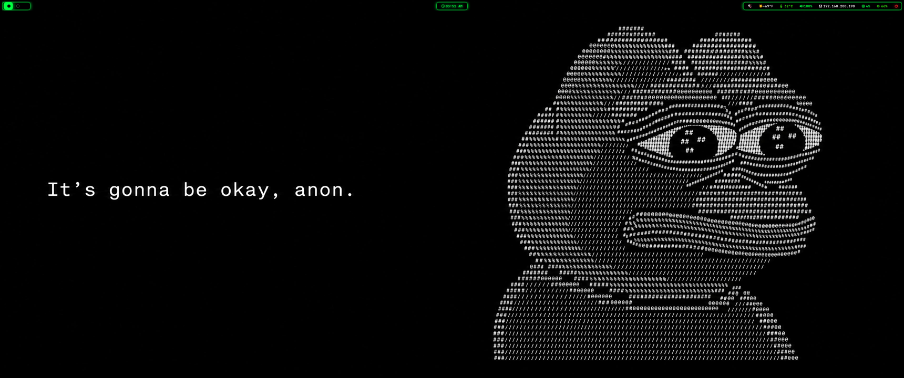
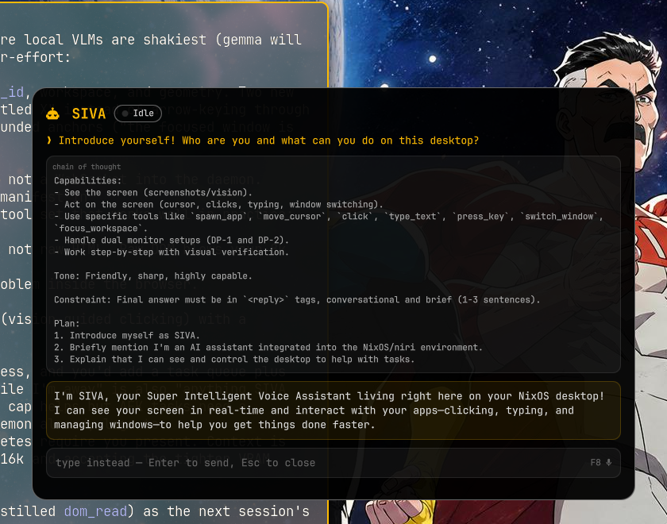

# nixos-btw — Invincible rice 🟡🔵

NixOS 26.05 · [niri](https://github.com/YaLTeR/niri) scrolling WM · Wayland · dual 3440×1440@180
· RTX 4090 · themed after *Invincible* (yellow `#fcba03` / blue `#0026ff` / black).

## What's inside

| Path | What |
|---|---|
| `nixos/` | System config — NVIDIA open modules + Wayland, SDDM ([SilentSDDM](https://github.com/uiriansan/SilentSDDM)), PipeWire, ydotool |
| `config/niri/` | WM config: binds, layout, animations, window rules |
| `config/quickshell/` | Custom QML shell widgets: corner clock, power menu, sysinfo popup, workspace preview, voice overlay, **SIVA** |
| `config/waybar/` | Bar + Invincible CSS |
| `config/wofi/` | Launcher + emoji picker styling |
| `config/ghostty/` | Terminal (JetBrains Mono NF, blur, shader picker) |
| `config/fastfetch/` | Fetch with OS age, RAM, weather |
| `bin/` | Helper scripts: push-to-talk voice typing (whisper.cpp), waybar modules, audio manager |
| `home/zshrc` | `(λ)³ [hope] >` |

## SIVA — local agentic voice assistant

**F8** summons [SIVA](https://github.com/vincentisvalid/siva), a fully-local voice assistant
(gemma-4-31B-it on llama.cpp) that streams its chain of thought to a quickshell overlay,
*sees* the screen, and drives the desktop — cursor, typing, window switching. It lives in
its own repo; the widget QML here is a snapshot.

## Keybinds (highlights)

| Key | Action |
|---|---|
| `F8` | SIVA voice assistant (toggle) |
| `F9` | Push-to-talk voice typing anywhere |
| `Mod+Return` / `Mod+D` | ghostty / wofi |
| `Mod+←→↑↓` or `HJKL` | Focus column/window |
| `Mod+O` | Overview |
| `Mod+Shift+E` | Power menu (quickshell) |

## Notes

- `nixos/hardware-configuration.nix` is machine-specific — regenerate your own.
- Ghostty shaders aren't vendored (37 MB of third-party GLSL); grab them from
  [hackr-sh/ghostty-shaders](https://github.com/hackr-sh/ghostty-shaders) and friends
  into `~/.config/ghostty/shaders/`, then `bin/ghostty-shader-pick` picks one per session.
- Wallpaper not included (it's Invincible key art — you know where to find it).
- Voice typing (`bin/voice-type`) expects a whisper.cpp model at
  `~/.local/share/voice-type/models/ggml-tiny.bin` and prefers a Focusrite Scarlett 2i2 input.

## License

MIT (configs and scripts; referenced third-party themes/shaders keep their own licenses)
